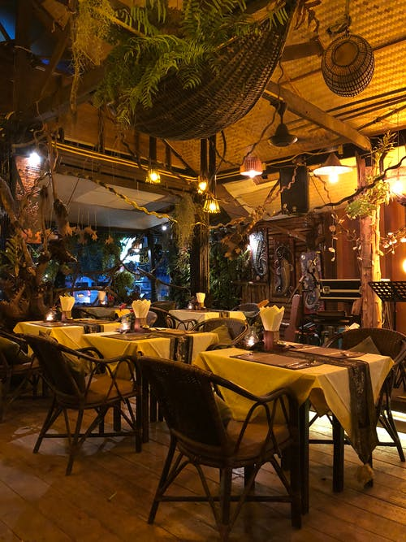
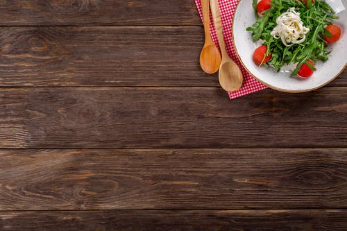

# 🍔 Quick Cuisine - Food Delivery Website

A visually rich, responsive, and user-friendly food delivery website designed to showcase menu items and streamline the online ordering experience. Built using **HTML**, **CSS**, and **JavaScript**, this project simulates the front-end interface of a food delivery service.

---

## 🚀 Features

- 🏠 Elegant Home Page Design
- 🍽️ Menu Showcase with vibrant images
- 📦 Order Placement Simulation
- 📱 Responsive layout for various screen sizes
- 🎨 Custom UI with images, backgrounds, and branding
- ⚙️ Interactive elements via JavaScript

---

## 🖼️ Screenshots

### 🔹 Home Page


### 🔹 Menu & Ordering


### 🔹 Gallery & Backgrounds


> Additional visuals: `aa1.jpeg`, `logo2.jpeg`, `bulk.jpg`, and more in the image assets

---

## 🗂️ Project Structure

```
quick-cuisine/
│
├── index.html             # Main homepage
├── second.html            # Secondary ordering or details page
├── style1.css             # Stylesheet for layout and design
├── myscript.js            # JS for basic interactivity
├── *.jpeg / *.jpg / *.png # Image assets (UI, logos, backgrounds)
└── README.md              # Project description
```

---

## 💡 How to Run

1. Download or clone the repository:
```bash
git clone https://github.com/yourusername/quick-cuisine.git
```

2. Open `index.html` in any modern browser (Chrome, Firefox, Edge).

No server or database required — this is a front-end project only.

---

## 🔧 Technologies Used

- 💻 HTML5
- 🎨 CSS3
- 🧠 JavaScript (Vanilla)
- 🖼️ JPEG, PNG images for design

---

## 📦 Ideal For

- Showcasing your front-end development skills
- Creating a portfolio project
- Simulating food/app ordering UIs
- Practicing website design aesthetics

---

## 🙌 Acknowledgments

This project was made for learning and showcasing web design capabilities. All assets are used for educational/demo purposes.

---

## 👨‍🍳 Created By

**Your Name**  
📧 your-email@example.com  
🌐 Portfolio: your-portfolio-link.com

---

## ⭐ Like this Project?

Give it a ⭐ on GitHub and share it with fellow developers and designers!

